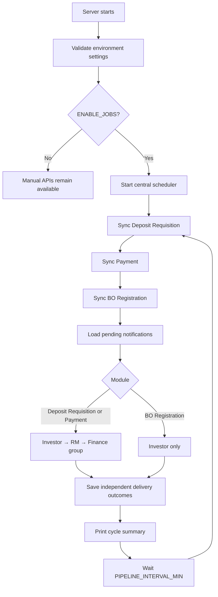

# Notification Pipeline

```mermaid
flowchart TD
    A["Server starts"] --> B["Validate environment settings"]
    B --> C{"ENABLE_JOBS?"}
    C -->|No| D["Manual APIs remain available"]
    C -->|Yes| E["Start central scheduler"]

    E --> F["Sync Deposit Requisition"]
    F --> G["Sync Payment"]
    G --> H["Sync BO Registration"]
    H --> I["Load pending notifications"]

    I --> J{"Module"}
    J -->|Deposit Requisition or Payment| K["Investor → RM → Finance group"]
    J -->|BO Registration| L["Investor only"]

    K --> M["Save independent delivery outcomes"]
    L --> M
    M --> N["Print cycle summary"]
    N --> O["Wait PIPELINE_INTERVAL_MIN"]
    O --> F
```

Each sync failure is recorded without stopping the other modules.
Each recipient has independent delivery tracking.
Trade Confirmation remains a manual SMS/email workflow.